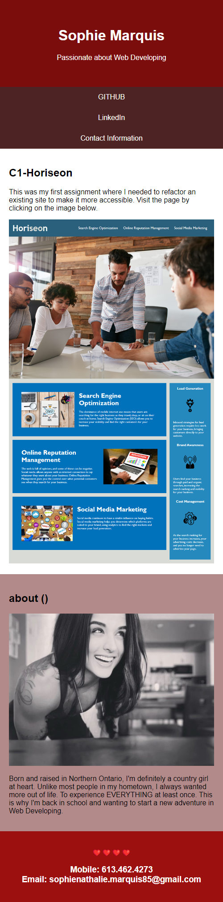
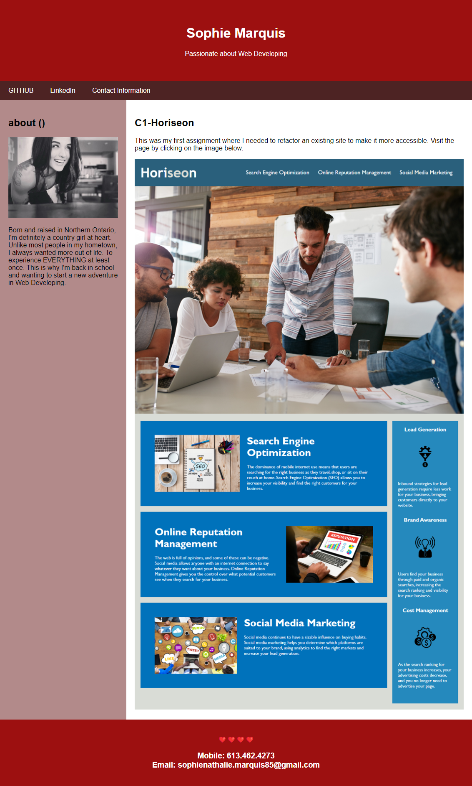

# C2-Portfolio

## Main Task

To build a portfolio page from scratch.

## Requirements:

## User Story

```
AS AN employer
I WANT to view a potential employee's deployed portfolio of work samples
SO THAT I can review samples of their work and assess whether they're a good candidate for an open position

```
## Acceptance Criteria

```
GIVEN I need to sample a potential employee's previous work
WHEN I load their portfolio
THEN I am presented with the developer's name, a recent photo or avatar,
and links to sections about them, their work, and how to contact them 
WHEN I click one of the links in the navigation
THEN the UI scrolls to the corresponding section
WHEN I click on the link to the section about their work
THEN the UI scrolls to a section with titled images of the developer's applications
WHEN I am presented with the developer's first application
THEN that application's image should be larger in size than the others
WHEN I click on the images of the applications
THEN I am taken to that deployeI resize the page or view the site on various screens and devices
THEN I am presented with a responsive layout that adapts to my viewport

``` 
> **(User Story and Acceptance Criteria / Challenge 2; CARL-VIRT-FSF-PT-04-2023, README.md 2023)** 

## Final Work Review

**"Keep the coding clean."** This action was applied to both HTML and CSS with the help of Patrick Lake(Tutor), Google, W3Schools. Looks cleaner, organised and much more easier to read. Advice on how to build a proper HTML page, from my first Challenge, has been applied for this Challenge.

> **(Challenge 2; CARL-VIRT-FSF-PT-04-2023, README.md 2023)**

When my portfolio is being loaded you'll be presented with my name, my photo and a mini bio in the **about ()** section. Links to my profiles on GITHUB and LinkedIN have been added to a navigation bar. A Contact Information link was added as well but will redirect you to the bottom of the page, when clicked, where my mobile number and email are displayed.

**GITHUB**, **LinkedIN** and the image shown on my page (**C1-Horiseon**) will redirect the viewer, when clicked, to another tab showing my professional, social media sites and my first assignment.  

Let's not forget that when the page is being viewed on various devices and screens, a responsive layout will adapt to the viewport. The following previews show the web application's appearance when viewed on various devices: 

## Smartphones


## Tablets, Laptops and Desktops



The final product can be viewed here: [C2-Portfolio](https://smarquis85.github.io/C1-Horiseon/)
